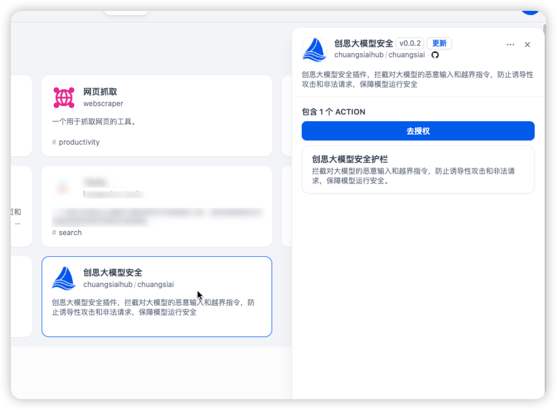
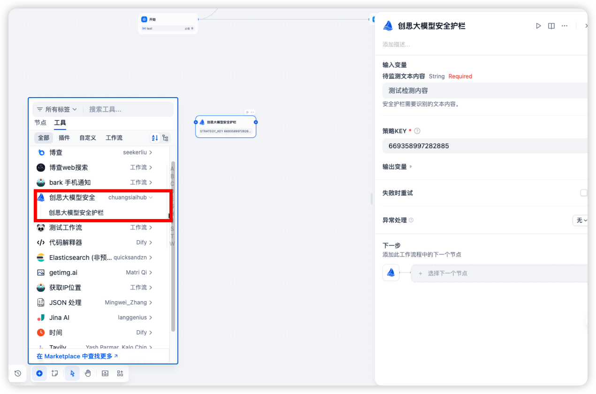

## Chuangsiai Model Security Plugin

**Author:** chuangsiaihub
**Version:** 0.0.2
**Type:** tool

### Description

This plugin provides security tools for the Chuangsiai model, including security detection and answering capabilities. It is designed to enhance the security features of the Chuangsiai model by integrating various security functionalities.

#### The Chuangsiai Tools plugin includes the following tools:

- Security Detection
- Security Answering（is coming）

### Configuration

#### 1. Apply for API AccessKey and SecretKey

Apply for AccessKey and SecretKey in the [**Chuangsi Security Console**](https://console.chuangsiai.com/#/profile/accessKey).

#### 2. Get the **Chuangsi AI Security** Tool from the Plugin Marketplace

You can find the **Chuangsi AI Security** tool in the plugin marketplace. Please install it.

#### 3. Configure in Dify

On the Dify navigation page, go to Tools > **Chuangsi AI Security** > Authentication, then enter the AccessKey and SecretKey obtained from the [**Chuangsi AI Security Console**](https://console.chuangsiai.com/#/profile/accessKey).

#### 4. Using the Tool

You can integrate **Chuangsi AI Security Console** tools in the following application types:

#### Chatflow/Workflow Applications

Both Chatflow and Workflow applications support the addition of **Chuangsi AI Security** tool nodes.
